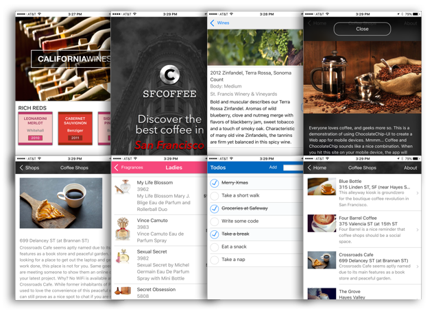

ChocolateChip-UI
================

A Framework for Building Hybrid Apps
------------------------------------



----------------------------------

ChocolateChip-UI is a framework of layouts, widgets and components to make it easy to create mobile Web apps and hybrid apps. Layouts provide the structure for your app, and components and widgets let you display data and capture user interaction in meaningful ways.

Built on Standards
------------------
ChocolateChip-UI is based on ES6 (ECMAScript 2015). It uses Rollup and Babel so you can use the latest advanced features and still support users on older Android phones. ES6 patterns create elegant code and less bugs.

The Goods
----------

ChocolateChip-UI provides the following to help you build apps:

1. Layouts
2. DOM Methods
3. Synthetic Events and Gestures
4. Components
5. State Object
6. Widgets
7. Pubsub
8. Routing
9. Utilities
10. Themes for Android and iOS

Layouts
-------
Layouts are implemented with simple markup. Simple to understand, they create amazing visuals for your app.

DOM Methods
-----------
There are a handful of basic DOM methods if you have to do things the jQuery way. Mostly you shouldn't, honestly.

Events &amp; Gestures
---------------------
ChocolateChip-UI provides support for standard desktop and touch gestures. Better still, it provides sythetic "touch" gestures that work the same on desktop and mobile.

* tap
* dbltap
* longtap
* swipeleft
* swiperight
* swipeup
* swipedown


Components
----------
Components let you define custom templates for your data, create stylesheets scoped to the component and use mobile-friendly gestures. Components bound to state are reactive, when state changes, they update automatically. Whatever you need to do that touches the DOM should be done with reactive components.

Here is a typical component:

```javascript
const peopleList = new Component({
  element: '#peopleList',
  state: peopleState,
  render: (person) => html`
    <li>;
      <h3>
        ${ person.name.last }, ${ person.name.first }
      <h3>
      <h4>
        ${ person.job }
      </h4>
    </li>`,
  actions: {
    event: 'tap',
    element: 'li',
    callback: (e) => console.log(e.target.textContent.trim())
  },
  styles: {
    li: {
      backgroundColor: '#fafafa',
      h3: {
        color: 'blue'
      }
    }
  }
})

// Render the component:
peopleList.render()
```

This is a flowchart for how components work:


State
-----
As we saw above, components can be bound to state. State objects make your components and widgets reactive. They abstract your data and provide convenient methods for manipulating your data. When you update state objects, ChocolateChip-UI updates the DOM of their bound components and widgets.

Widgets
-------
Widgets let you quickly implement complex user interfaces:

* ui-busy
* ui-editable
* ui-multi-select-list
* ui-navigation
* ui-paging
* ui-popover
* ui-popup
* ui-range
* ui-router
* ui-segmented
* ui-select-list
* ui-sheet
* ui-slideout
* ui-stepper
* ui-switch
* ui-tabbar

Pubsub
------
Pubsub is our event bus. Use it to create mediators that decouple entangled code. Our router uses pubsub, and routing is used by navigation lists, tab bars and slideout menus. Pubsub helps ChocolateChip-UI handle complex rendering decisions.

Routing
-------
ChocolateChip-UI has an internal routing system that lets you use user interactions to determine what data to display. This results in leaner, easier to maintain interfaces. Interestingly, routing is implemented independently of the browser url.

Utilities
---------
ChocolateChip-UI's utilities make complicated tasks easy. We're talking nerdy functionality like pluck, unique, flatten, compare, chunk, debounce, etc.

* after
* array_difference
* array_flatten
* array_intersection
* array_mixin
* array_pluck
* array_unique
* before
* chunk
* compare
* debounce
* form
* formatters
* mixin
* once
* serialize
* throttle
* validators

Themes
------
So you made your app for Android and now want to target iOS? Just switch your app's stylesheet from `android` to  `ios`. It's that easy. Need to support a right to left language like Arabic or Hebrew? Just put `dir='rtl'` on the `html` tag. Everything will switch around to work exactly as it should.


Predictability
--------------
When you build a reactive app with components, widgets and state, everything updates automatically. When you build an app writing DOM manipulation functions in a tangled pile, you might forget to update something, introducing bugs.

As you can see, ChocolateChip-UI is all about that [KISS](https://en.wikipedia.org/wiki/KISS_principle).

To learn more about using ChocolateChip-UI to build apps, visit the [website](https://chocolatechip-ui.github.io).
